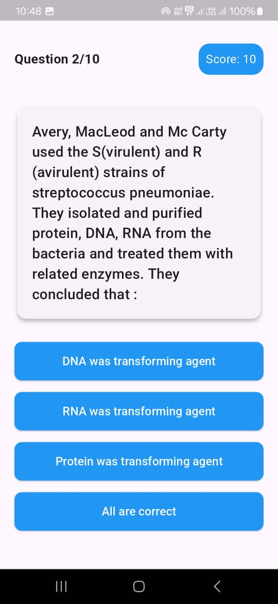
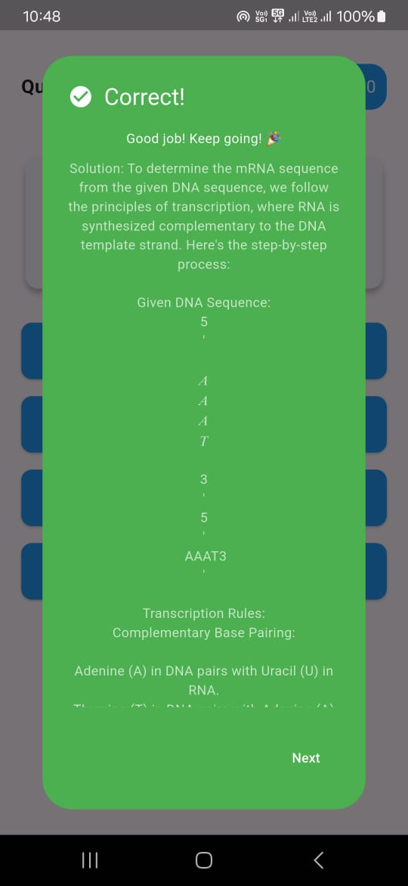
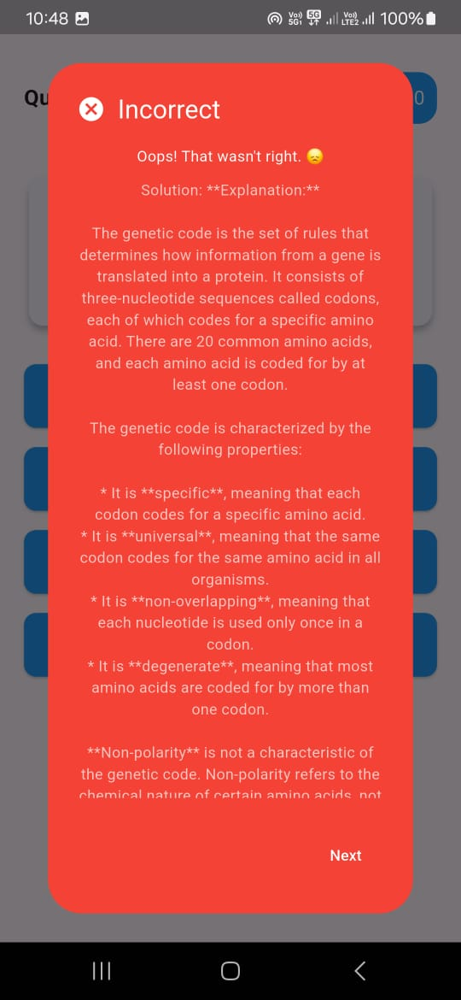

# Flutter Quiz App

A gamified quiz application built with Flutter that fetches questions from an API and provides an
engaging user experience with animations and score tracking.

## Features

- 🎮 Clean and intuitive user interface
- 📱 Responsive design for various screen sizes
- 🌟 Gamification elements (points, achievements)
- 🔄 Real-time score tracking
- 🏆 Personalized result messages
- ⚡ Smooth animations and transitions

## Screenshots

      

## Demo Video

https://github.com/user-attachments/assets/cd1fd940-55a8-48e1-a2ef-59320005872f

## Setup Instructions

1. Clone the repository:

```bash
git clone https://github.com/i-aman-jha/quiz-app.git

```

2. Navigate to the project directory:

```bash
cd flutter_quiz_app
```

3. Install dependencies:

```bash
flutter pub get
```

4. Run the app:

```bash
flutter run
```

## Dependencies

Add the following to your `pubspec.yaml`:

```yaml
dependencies:
  flutter:
    sdk: flutter
  http: ^1.1.0
```

## Project Structure

```
lib/
  ├── main.dart          # Main application entry point
  ├── models/            # Data models
  ├── screens/           # UI screens
  ├── widgets/           # Reusable widgets
  └── controllers/       # GetX controllers
  
```

## Implementation Details

- The app follows a clean architecture pattern
- Uses Flutter's built-in state management
- Implements error handling for API requests
- Features smooth animations for transitions
- Includes gamification elements like points and achievement messages
